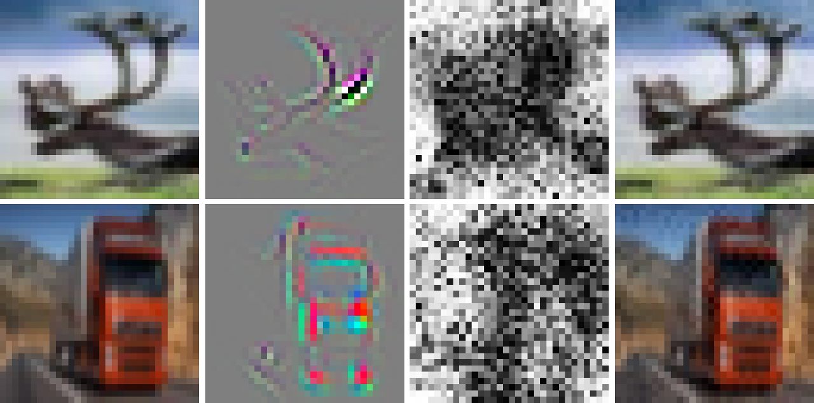

# PQP: Perceptual Quality-Preserving black-box attack
Codebase for reproducing the results in the paper "Perceptual Quality-preserving Black-Box Attack against Deep Learning Image Classifiers". The paper can be found on [arxiv](http://arxiv.org/abs/1902.07776).



## Requirements
- Python3
- [TensorFlow](http://www.tensorflow.org/) 1.14 (may work with previous versions, too).
- To replicate the results of the paper, [PyTorch](http://pytorch.org) 1.0 is also needed.
- We used the PyTorch models and the weights provided [here](http://github.com/huyvnphan/PyTorch-CIFAR10). Import the python module and download the weights in './CIFAR10_pretrained_models/'.

## CIFAR10 test
To run the code with default parameters, type:
```
python main.py
```
Modify the main.py file according to your needs.
For any problem or comment, do not hesitate to contact me.

## Citation
```
@misc{gragnaniello2019perceptual,
    title={Perceptual Quality-preserving Black-Box Attack against Deep Learning Image Classifiers},
    author={Diego Gragnaniello and Francesco Marra and Giovanni Poggi and Luisa Verdoliva},
    year={2019},
    eprint={1902.07776},
    archivePrefix={arXiv},
    primaryClass={cs.CV}
}
```
